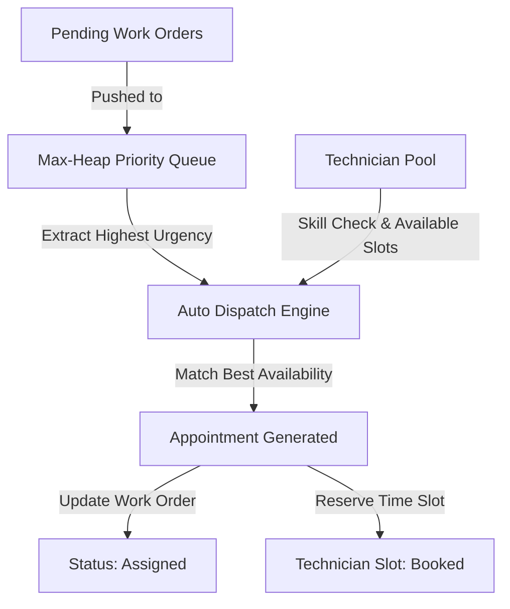

# 🛠️ Field Service Dispatch & Resource Management System


A high-performance **Field Service Management & Automated Logistics Dispatch System** built in C++ using core **Data Structures and Algorithms (DSA)**.

---

## 📖 Real-World Problem Statement

Field service industries (HVAC repair, plumbing, electrical grid maintenance, medical equipment servicing, and telecommunications) face critical operational challenges:

1. **Dispatch Delays**: Manually assigning emergency repair requests (e.g. medical oxygen generator failure) leads to costly service delays.
2. **Skill Mismatches**: Sending a technician who lacks specific certifications or skills results in incomplete calls and repeated visits.
3. **Double-Booking & Utilization Inefficiencies**: Without real-time slot tracking, technicians are either overbooked or underutilized.
4. **Data Disconnect**: Unstructured tracking of Customer Work Orders, Equipment Assets, Technicians, and Appointments leads to lost records.

---

## 💡 The Solution

This system automates field service operations using specialized **Data Structures**:

* **Max-Heap Priority Queue ($O(\log N)$)**: Automatically prioritizes urgent Work Orders (`High` > `Medium` > `Low`) so emergency jobs are dispatched first.
* **Custom Generic Linked List**: Manages dynamic domain records (Users, Customers, Skills, Assets, Work Orders, Technicians, Appointments) in memory without memory leaks.
* **Slot Allocation Engine**: Tracks 16 operating time slots per technician (`AVAILABLE`, `BOOKED`, `BLOCKED`) to prevent overbooking and calculate real-time utilization.
* **Interactive Cascade Deletion**: Deleting records automatically cleans up dependent records (e.g. deleting a Customer removes related Work Orders and frees booked slots).
* **CSV File Persistence**: Automatically saves and loads database states across executions to `./data/`.

---

## 🏗️ System Architecture & Workflow



---

## 🧩 Data Structures & Algorithmic Complexity

| Component | Data Structure Used | Operational Purpose | Time Complexity |
| :--- | :--- | :--- | :---: |
| **Dispatch Queue** | **Max-Heap (Binary Tree)** | Priority ordering of pending work orders | $O(\log N)$ Push / Pop |
| **Entity Storage** | **Generic Linked List** | Dynamic storage for Users, Customers, Assets, etc. | $O(N)$ Traversal / Search |
| **Schedule Slots** | **Fixed-size Vector** | 16 time slot array per technician | $O(1)$ Direct Index Access |
| **Skill Matching** | **Dynamic Vector** | Skill set filtering per technician | $O(S)$ Skill Set Search |
| **Data Engine** | **CSV File Streams** | Flat-file persistent database storage | $O(N)$ Disk I/O |

---

## 📋 Comprehensive 23-Option Menu System

```text
============================================================
               FIELD SERVICE DISPATCH SYSTEM                
============================================================

 1. Add User                       2. Add Customer
 3. Add Skill                      4. Add Work Order
 5. Add Technician                 6. Add Asset

 7. List Appointments              8. List Users
 9. List Customers                10. List Skills
11. List Work Orders              12. List Technicians
13. List Assets

14. Dispatch Work Orders          15. Create Appointment Manually
16. Complete Appointment (by ID)  17. Complete All Appointments
18. Block Technician's Slot       19. Add Sample Data

20. Show Technician Utilization   21. Show Pending Work Orders
22. Delete Record                 23. Save & Exit
============================================================
```

---

## 📂 Repository Structure

```text
DSA-Project/
├── data/                       # Flat-file CSV Database
│   ├── users.csv               # System User Accounts
│   ├── customers.csv           # Customer Profiles
│   ├── skills.csv              # Skill Catalog & Levels
│   ├── assets.csv              # Equipment Asset Catalog
│   ├── workorders.csv          # Work Orders (Pending/Assigned/Completed)
│   ├── technicians.csv         # Technicians & 16-Slot Schedules
│   └── appointments.csv        # Scheduled Appointments
│
├── src/                        # Source Code & Executable
│   ├── Main.cpp                # Core C++ Application Source Code
│   └── Main.exe                # Compiled Binary Executable
│
└── Project Sample Data.txt     # Benchmark Reference Dataset
```

---

## ⚙️ Build and Run Instructions

### Prerequisites
* **C++ Compiler**: GCC / G++ (supporting C++11 or higher)
* **OS**: Windows / Linux / macOS Terminal

### Compile Command
From the project root directory, compile `Main.cpp`:

```powershell
g++ -std=c++11 src/Main.cpp -o src/Main.exe
```

### Run Command
Execute the compiled binary:

```powershell
# Windows
.\src\Main.exe

# Linux/macOS
./src/Main.exe
```

---

## 🎯 Demonstration Guide (For Presentation / Reviewers)

To demonstrate the full capabilities of the system:

1. **Option 19 (Add Sample Data)**: Seed the system with initial benchmark data (5 Users, 5 Customers, 7 Skills, 10 Assets, 18 Work Orders, 3 Technicians, 5 Appointments).
2. **Option 21 (Show Pending Work Orders)**: View pending work orders ordered by urgency (`High`, `Medium`, `Low`).
3. **Option 14 (Dispatch Work Orders)**: Run the Max-Heap priority engine. Observe how `High` priority orders are extracted first and matched with qualified technicians.
4. **Option 7 (List Appointments)**: Inspect newly generated appointments with assigned technician IDs and slot numbers.
5. **Option 20 (Show Technician Utilization)**: View real-time schedule slot booking percentages.
6. **Option 22 (Delete Record)**: Open the interactive Delete sub-menu to demonstrate targeted record deletion and automatic cascade cleanup.
7. **Option 16 / 17 (Complete Appointments)**: Complete appointments to free technician slots for future dispatching.
8. **Option 23 (Save & Exit)**: Save all database changes cleanly to `./data/`.
